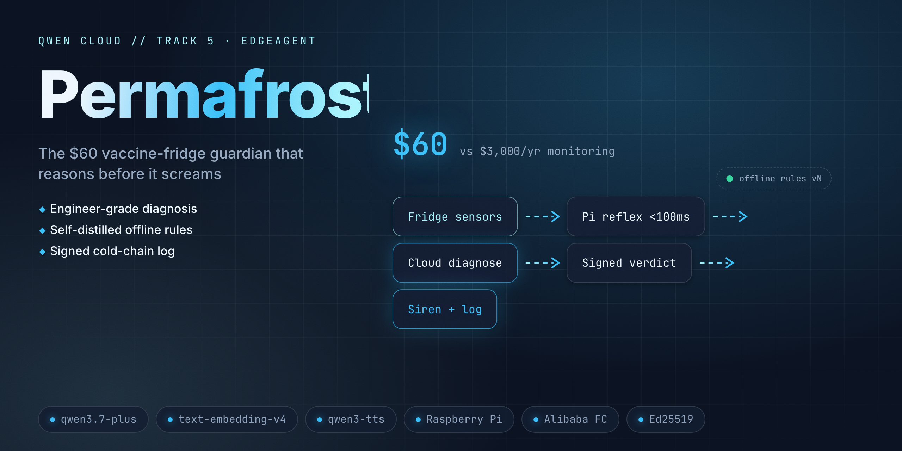

# Permafrost — DEMO / judge script

Two paths. **Path A (replay)** needs zero hardware and zero API keys and reproduces
the entire loop — this is the supported judging path. **Path B (live hardware)** is
the on-camera showmanship for the video. Both drive the *identical* `EdgeDaemon`.

---

## Path A — replay (zero hardware, ~3 minutes)

```bash
python3.12 -m venv .venv && source .venv/bin/activate
pip install -e ".[dev]"
```

### A0. Prove it's real first (30s)

```bash
pytest -q                                   # 331 tests, all offline
python scripts/check_submission_readiness.py  # deliverables + smoke + honesty gates
```

### A1. The critical curve — door left ajar (the money beat)

```bash
permafrost replay --curve seeds/door_ajar.csv --db audit.db --fresh
```

Watch for, in order:
- `REFLEX CRITICAL door_timer` then `REFLEX WATCH fast_rise` — the **local alarm fires
  in <1 ms**, before any cloud call.
- an `ExcursionVerdict [EXCURSION]` card: `cause: door_ajar`, a stock-risk ETA, an
  `evidence` list, a **guidance citation**, and a live-looking `task id`.
- `chain: OK — … entries re-derived, chain intact; 1 signed daily root verified`.

### A2. The benign twin — defrost cycle (the anti-false-alarm beat)

```bash
permafrost replay --curve seeds/defrost_cycle.csv --db defrost.db --fresh
```

Near-identical +3.2 °C spike — but the verdict card reads `cause: defrost_cycle`,
`BENIGN`, and **no alarm sounds**. A threshold monitor would have screamed here; this
is exactly the false alarm that gets monitors unplugged. Side by side with A1 that is
the whole product on one screen.

### A3. Pull the (virtual) Ethernet cable

```bash
permafrost replay --curve seeds/door_ajar.csv --db offline.db --fresh \
    --offline-from 1700 --online-from 2100
```

- `~~ NETWORK CUT — OFFLINE mode, local rules v1 protecting ~~`
- the door alarm **still fires** while offline; events **queue** (ECIES-sealed).
- `~~ RECONNECTED — syncing queued events ~~` → the queue drains, verdicts arrive,
  the chain stays **gap-free**.

Same thing as a hard CI assertion (also blocks real sockets to prove offline-first):

```bash
python scripts/verify_offline.py        # exits 0
```

### A4. Tamper-evidence

```bash
permafrost verify-chain audit.db                    # OK, exit 0
sqlite3 audit.db "UPDATE log_chain SET entry=replace(entry,'4.0','9.9') WHERE seq=50;"
permafrost verify-chain audit.db ; echo "exit=$?"   # CHAIN FAIL at seq 50, exit 1
```

One byte moved → verification fails and names the sequence. (Re-run A1 `--fresh` to
restore a clean db.)

### A5. The self-teaching loop

```bash
permafrost distill --db defrost.db --activate
```

`qwen3.6-flash` compiles the fridge's own verdict history into an **IF/THEN local rule
bundle**, Ed25519-signs it, and the edge **verifies the signature before hot-swapping**
to rules v2 (a `defrost_recognizer` that resolves benign spikes locally). Refuse the
signature and it would be rejected — try it: pass a tampered bundle and watch `REFUSED`.

### A6. The numbers + the weekly report

```bash
permafrost bench --seeds seeds --out docs/BENCH.md    # confusion matrix, latency, $/day
permafrost report --week 2 --db audit.db              # VFC-style compliance summary
```

`bench` prints the 4-class confusion matrix (accuracy 1.000 on the fixtures), reflex
p95 latency (<0.01 ms), and the **$/day before vs after distillation** cost curve.

### A7. (optional) Prove the Qwen Cloud wiring is real — no valid key needed

```bash
PERMAFROST_LIVE=1 DASHSCOPE_API_KEY=sk-bogus \
    permafrost replay --curve seeds/door_ajar.csv --db live.db --fresh
```

The **identical** graded command flips off `FakeQwen` and drives `/diagnose` into a
real DashScope round-trip. A bogus key gets an authentic Model-Studio `401` back,
rendered as a clean card (exit code 3, no traceback):

```
┌─ LIVE Qwen transport ────────────────────────────────
│ LIVE transport reached DashScope — authentication failed (invalid_api_key)
│ endpoint   : https://dashscope-intl.aliyuncs.com/compatible-mode/v1
│ request_id : 1c76e902-1991-9c4e-b18f-e31c04bb985a
│ The wiring is real; supply a valid DASHSCOPE_API_KEY to get a live verdict.
└──────────────────────────────────────────────────────
```

The real `request_id` is the proof the transport reaches `qwen3.7-plus` at
`dashscope-intl.aliyuncs.com`, not a local stub. Drop in a **valid** key and the
verdict card shows a real DashScope `task id` (no `fake-` prefix) and the model's own
reasoning. Everything else in this script stays offline + keyless on `FakeQwen`.
*(The author has not run a successful live inference — no valid key on hand; see
README Status.)*

---

## Path B — live hardware (the on-camera video, SPEC §13 beat sheet)

BOM + pin map: [`edge/wiring.md`](edge/wiring.md). On the Pi:

```bash
pip install -e ".[dev,hardware]"    # w1thermsensor + gpiozero (Pi only; imports guarded elsewhere)
permafrost daemon --db audit.db --cloud-url https://<your-fc-endpoint>
```

Beat sheet (3:00): hook → the rig on camera, probes into a mini fridge → **pen in the
door**: chirp, verdict card streams with reasoning + citation + ETA → defrost replay:
"benign — here's why" → **pull the Ethernet cable**, repeat the pen trick, OFFLINE badge,
local alarm still fires → reconnect: queue syncs, rules v1→v2 diff on screen, chain
verifies green → FC console + bench matrix → close.

> If parts are DOA the honest move is Path A on a laptop — the Pi is showmanship, the
> loop is the product. Say so on camera.

---

## What a judge is looking at

| Track-5 criterion | Where it shows up |
|---|---|
| perceive via edge sensors | 10 s sampler → ring buffer (A1); DS18B20/reed on the Pi (B) |
| reason via cloud APIs | `qwen3.7-plus` + thinking → `ExcursionVerdict` (A1), `text-embedding-v4` citation |
| act locally | reflex alarm in <1 ms, **before** the cloud round-trip (A1, A3) |
| privacy-aware data handling | events-only contract + ECIES-sealed batches — never raw streams (A3) |
| graceful degradation offline | cable-pull beat + `verify_offline.py` exit 0 (A3) |
