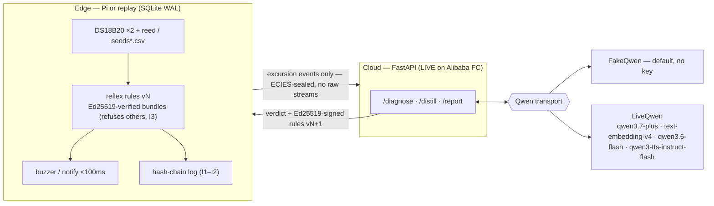

<div align="center">
  
  <h1>🧊 Permafrost</h1>
  <p><em>The vaccine fridge that argues for its own contents — a $60 edge guardian that reasons about your cold chain instead of just alarming on it.</em></p>
  

  <br/><br/>

  [](https://permafrost.edycu.dev)
  [](https://permafrost-hoznckcsox.ap-southeast-1.fcapp.run/health)
  [](https://permafrost.edycu.dev/pitch/)
  [](DEMO.md)
  [](https://qwencloud-hackathon.devpost.com/)

  <br/>

  
  
  
  
  
  
  [](LICENSE)
  [](https://github.com/edycutjong/permafrost/actions/workflows/ci.yml)
</div>

A **$60 edge guardian** for clinic vaccine fridges. A Raspberry Pi senses temperature/door/power and reacts in **milliseconds** from local rules; a cloud **Qwen** brain diagnoses each excursion like a refrigeration engineer — *"sawtooth every 6h = defrost cycle, benign"* vs *"door-ajar signature, stock at risk in 22 minutes, alarm now"* — citing cold-chain guidance; and a **SHA-256 hash-chained, Ed25519-signed log** makes compliance tamper-evident through blackouts and offline weeks.

> A nurse in a two-room clinic opens the fridge on Monday and finds Friday's power blip silently cooked $8,000 of childhood vaccines. The monitor that could have warned her was unplugged months ago — because it screamed at every defrost cycle. Permafrost exists to kill that false-alarm fatigue.

**Track 5 — EdgeAgent**: perceive via edge sensors, reason via cloud APIs, act locally, degrade gracefully. **Judges need zero hardware** — replay mode drives the *identical* daemon from recorded curves.

MIT licensed. Python 3.12. The Pi is showmanship; **the loop is the product**.

> **Live on Alibaba Function Compute.** The FastAPI brain is deployed on managed `python3.10` at **[permafrost-hoznckcsox.ap-southeast-1.fcapp.run](https://permafrost-hoznckcsox.ap-southeast-1.fcapp.run/health)** (`/health`, `/run`, `/verify` — see [☁️ Deployed](#-deployed-on-alibaba-function-compute)). It's an edge + CLI product, so there's no interactive web app to click; everything below also runs locally in ~3 minutes, offline and keyless (`permafrost replay ...`) — see [DEMO.md](DEMO.md) for the full judge script.

---

## 🚀 Quickstart (zero hardware, zero API keys)

```bash
python3.12 -m venv .venv && source .venv/bin/activate
pip install -e ".[dev]"

# 1. The critical curve: door left ajar -> reflex alarm + cloud verdict + citation
permafrost replay --curve seeds/door_ajar.csv --db audit.db --fresh

# 2. The benign twin: near-identical spike -> "defrost cycle, benign" (anti-false-alarm beat)
permafrost replay --curve seeds/defrost_cycle.csv --db defrost.db --fresh

# 3. Pull the (virtual) Ethernet cable mid-run: local alarm still fires, queue grows, reconnect syncs
permafrost replay --curve seeds/door_ajar.csv --db offline.db --fresh --offline-from 1700 --online-from 2100

# 4. Prove the log is tamper-evident (exit 1 if any byte was touched)
permafrost verify-chain audit.db

# 5. The self-teaching loop: cloud distills signed local rules from its own verdicts
permafrost distill --db defrost.db --activate

# 6. Weekly VFC-style compliance report, mined from the chain (replay curves live in ISO week 2)
permafrost report --week 2 --db audit.db

# 7. The numbers: confusion matrix, reflex latency, $/day pre/post-distill
permafrost bench --seeds seeds
```

Offline degradation as a test (kills real sockets, cuts the link mid-replay):

```bash
python scripts/verify_offline.py
```

Full suite + invariants:

```bash
pytest             # <!--TEST_COUNT-->331 tests<!--/TEST_COUNT-->, all offline, no API keys
python scripts/bench.py
python scripts/check_submission_readiness.py
```

## 📊 The one demo that matters

`seeds/defrost_cycle.csv` and `seeds/door_ajar.csv` are engineered twins: near-identical +3.2–3.4 °C spikes. Threshold monitors alarm on **both** — that's why staff unplug them. Permafrost's cloud brain reads the co-signals (humidity flat + 6h periodicity vs humidity spike + door reed) and calls one **benign, with reasoning** and one **critical, with a stock-risk ETA and a guidance citation**. One screen, false-alarm fatigue dead.

## 🏗️ Architecture



<sub>**As built** = the offline-first loop (all green on FakeQwen, zero hardware via replay). Live Qwen sits behind `DASHSCOPE_API_KEY` + `PERMAFROST_LIVE=1`; the FastAPI brain is **deployed live on Alibaba Function Compute** (`infra/fc/`, managed python3.10). Plain-text view below.</sub>

```
┌────────────────────────── EDGE (Pi / replay) ───────────────────────────┐
│ DS18B20 ×2 + reed + mains sense (or seeds/*.csv on a virtual clock)     │
│   → 10s sampler → 24h ring buffer (SQLite WAL)                          │
│   → reflex rules vN  ← Ed25519-VERIFIED signed bundles (refuses others) │
│   → buzzer/notify in <100 ms, zero connectivity needed                  │
│   → hash-chain log  h_i = SHA256(h_{i-1} ‖ canonical_json(entry))       │
│   → offline queue: events ECIES-sealed (SealedBox) to the cloud pubkey  │
└───────────────┬─────────────────────────────────────────────────────────┘
                │ excursion events only — never raw streams (privacy/bandwidth)
┌───────────────▼──────── CLOUD (FastAPI — LIVE on Alibaba FC) ────-───────┐
│ POST /diagnose  qwen3.7-plus + thinking → ExcursionVerdict (structured)  │
│                 text-embedding-v4 → CDC-style guidance citation (I4)     │
│ POST /distill   qwen3.6-flash → IF/THEN rule bundle + Ed25519 signature  │
│ GET  /report/weekly  VFC-style compliance summary (Batch-priced)         │
└──────────────────────────────────────────────────────────────────────────┘
```

The clever loop: during calm periods the cloud **distills its own verdict history into local rules**, signs the bundle, and the edge verifies the signature **before** hot-swapping. Pull the cable and rules v2 keep protecting the fridge; reconnect and the queue syncs into a gap-free chain.

## ☁️ Deployed on Alibaba Function Compute

The cloud brain is **live on Alibaba Cloud Function Compute** (managed `python3.10` runtime) — deployed, not just scaffolded:

**🔗 https://permafrost-hoznckcsox.ap-southeast-1.fcapp.run**

| Endpoint | What it does |
|---|---|
| `GET /health` | liveness probe — returns `{"status":"ok"}` |
| `GET /run` | runs the door-ajar replay **in the cloud** on the offline-deterministic `FakeQwen` engine, returning the verdicts + chain summary (byte-for-byte replayable, no key) |
| `GET /verify` | re-derives the hash chain and runs the offline-degradation checks (reflex fired while offline, sealed queue grew, drained on reconnect) **in the cloud**, returning green |

```bash
curl https://permafrost-hoznckcsox.ap-southeast-1.fcapp.run/health   # {"status":"ok"}
curl https://permafrost-hoznckcsox.ap-southeast-1.fcapp.run/run      # cloud replay → verdicts + chain OK
curl https://permafrost-hoznckcsox.ap-southeast-1.fcapp.run/verify   # cloud chain-verify + offline checks
```

The deployed endpoints run the **same offline-deterministic engine** the test suite and judging path use (`FakeQwen`), so the cloud reproduces the exact bytes, keylessly — `/run` reports `transport: FakeQwen (offline deterministic — no key required)`. Live Qwen inference stays key-gated behind `PERMAFROST_LIVE=1` + `DASHSCOPE_API_KEY` (the model path is wired and was smoke-tested against real DashScope — see [Live mode](#-why-only-qwen-cloud)); the graded cloud path deliberately does not depend on a key.

## 🔒 Tested invariants (COMPLEXITY.md I1–I4)

| # | Invariant | Test |
|---|---|---|
| I1 | Chain verifies **gap-free through a power cut** — a child daemon is hard-killed with `os._exit` mid-replay, the WAL survives, a fresh process resumes, and `verify-chain` is still green | `tests/test_invariants.py::test_I1_chain_gap_free_through_simulated_power_cut` |
| I2 | **Any 1-byte tamper** (entry, hash, seq, signed root) fails `verify-chain`, across all four curves | `tests/test_invariants.py::test_I2_one_byte_entry_tamper_fails` |
| I3 | Edge **refuses unsigned/forged/downgraded rule bundles** before hot-swap, and chain-logs the refusal | `tests/test_invariants.py::test_I3_edge_refuses_unsigned_bundle` |
| I4 | Every **CRITICAL verdict carries ≥1 guidance citation** — enforced in the pydantic schema itself | `tests/test_invariants.py::test_I4_every_critical_verdict_cites_guidance` |

## 🧩 Why ONLY Qwen Cloud

| # | Qwen surface | Without it |
|---|---|---|
| 1 | `qwen3.7-plus` + thinking (`chat.completions`) — deliberate multi-step reasoning over slopes, periodicity, humidity co-signals | a flash-tier pattern-matcher re-creates the "spike = alarm" false-positive problem we exist to kill |
| 2 | structured output — `ExcursionVerdict` JSON drives actuators | a free-text parse failure at 2 AM is a dead-vaccine failure |
| 3 | function calling — typed `sound_alarm`/`notify`/`annotate_log`/`schedule_service` tools | hand-rolled intent parsing between brain and siren |
| 4 | `text-embedding-v4` — guidance retrieval so every verdict cites authority | uncited advice reads as AI guesswork to a compliance officer |
| 5 | `qwen3.6-flash` — rule distillation is cheap, repetitive codegen run often | using the max-tier model burns the economics the bench must prove |
| 6 | `qwen3-tts-instruct-flash` — "urgent but calm" instruction-controlled alert voice | a TTS vendor without register control |
| 7 | Batch API — weekly compliance sweeps at −50% | full-price nightly sweeps on a $60-device budget |

Remove Qwen Cloud and Permafrost needs an LLM vendor, a vector store, a TTS vendor, and a hand-written rules engine — four systems and a bill a rural clinic will never pay.

**Live mode (bring your own key)**: the exact same graded command flips to real Qwen when — and only when — you opt in with both env vars:

```bash
export DASHSCOPE_API_KEY=sk-...  # your DashScope-intl key
export PERMAFROST_LIVE=1         # explicit opt-in; without it, FakeQwen
permafrost replay --curve seeds/door_ajar.csv --db live.db --fresh
```

Now the same `run_replay` path routes `/diagnose` through `LiveQwen` → `qwen3.7-plus` (with the thinking flag) at `https://dashscope-intl.aliyuncs.com/compatible-mode/v1`; the verdict card shows a **real DashScope `task id`** (not the `fake-…` prefix) and the model's own reasoning, and the same tamper-evident chain wraps it. Everything else in this repo — tests, `bench`, the whole judging path — runs **offline by default** on `FakeQwen`, a deterministic fixture-backed transport, so judges reproduce every byte keylessly with zero setup.

The transport really reaches Qwen Cloud — you can prove the wiring without a valid key. A **bogus** key drives the full replay into a real DashScope round-trip and comes back with an authentic Model-Studio `401` (note the real `request_id`), not a local stub. The CLI renders it as a clean card (exit code 3, no traceback):

```bash
$ PERMAFROST_LIVE=1 DASHSCOPE_API_KEY=sk-bogus permafrost replay --curve seeds/door_ajar.csv --db live.db --fresh
┌─ LIVE Qwen transport ────────────────────────────────
│ LIVE transport reached DashScope — authentication failed (invalid_api_key)
│ endpoint   : https://dashscope-intl.aliyuncs.com/compatible-mode/v1
│ request_id : 1c76e902-1991-9c4e-b18f-e31c04bb985a
│ The wiring is real; supply a valid DASHSCOPE_API_KEY to get a live verdict.
└──────────────────────────────────────────────────────
```

> **Honesty note:** the live model path was **smoke-tested with a real DashScope call**, so the wiring is verified end-to-end — and the bogus-key `401` above is the same proof any judge can reproduce **keylessly**. What this build does **not** contain is a *full end-to-end captured live run* (a whole `permafrost replay` graded through live Qwen with saved verdict text) — the deployed endpoints and the reproduced judging path run the offline `FakeQwen` engine by design. Routing is wired end-to-end and one command away for any key-holder; the `ExcursionVerdict` schema validator is the final gate on whatever the live model returns.

## ✅ Testing & CI

**5-stage pipeline:** Quality → Security → Build → Replay Smoke → Deploy Gate — see [`.github/workflows/ci.yml`](.github/workflows/ci.yml).

```bash
# ── Code Quality ────────────────────────────
ruff check .                                  # lint
mypy .                                        # type check
pytest --cov=permafrost --cov-report=term     # 331 tests, 100% coverage, offline+keyless

# ── Security ────────────────────────────────
pip-audit                                     # dependency vulnerability scan

# ── End-to-end (the actual product) ─────────
permafrost replay --curve seeds/door_ajar.csv --db audit.db --fresh
permafrost verify-chain audit.db
python scripts/verify_offline.py              # kills real sockets mid-replay
python scripts/check_submission_readiness.py  # deliverables + honesty gates
```

| Layer | Tool | Status |
|---|---|---|
| Lint | ruff | ✅ |
| Type checking | mypy (strict-ish, `ignore_missing_imports`) | ✅ |
| Unit + invariant testing | pytest (331 tests, I1–I4 invariants, 100% coverage) | ✅ |
| Security (SAST) | CodeQL (`python`) | ✅ |
| Security (SCA) | Dependabot (`pip` + `github-actions`) + `pip-audit` | ✅ |
| Secret scanning | TruffleHog (CI) + GitHub push protection (repo setting) | ✅ |
| Build verification | `python -m build` (wheel) + installed-CLI smoke test | ✅ |
| End-to-end | Replay the critical curve + `verify-chain` + `verify_offline.py` in CI | ✅ |

No Playwright/Lighthouse suite — Permafrost has no served web frontend (CLI + an in-process FastAPI app exercised entirely by the pytest suite and the replay smoke test above), so browser E2E and Lighthouse performance gates don't apply here.

## 🔧 Hardware (optional showmanship — BOM from SPEC §4)

Raspberry Pi 3B+/4/5 · 2× DS18B20 waterproof probes (1-Wire, GPIO4 + 4.7 kΩ) · magnetic reed switch (door) · piezo buzzer or relay module · power bank / UPS HAT (blackout demo) · any mini fridge as the prop. ≈ **$60 vs $1–3k/yr** commercial monitors. Wiring plan + pin map: [`edge/wiring.md`](edge/wiring.md). A Pi is commodity, widely-available hardware; replay mode removes it entirely from the judging path.

## 🗂️ Repo map

```
src/permafrost/        the pip package: daemon, chain, rules, crypto, qwen/, cloud/ (the FastAPI brain)
seeds/                 4 engineered curves + expected.json + fridge.json (seed.py --regen, byte-identical)
tests/                 the 331-test suite incl. invariants I1–I4 (all offline, keyless)
scripts/               bench.py · verify_offline.py · check_submission_readiness.py
infra/fc/              handler.py (FC entrypoint → the FastAPI app) + s.yaml + PROOF.md (deploy-evidence checklist)
edge/wiring.md         BOM + pin map + assembly notes (chain/bundle byte-formats: module docstrings in chain.py/rules.py/canonical.py)
docs/                  readme-hero.png · friction-log.md · BENCH.md (generated by scripts/bench.py)
.github/               CI/CD (ci.yml, codeql.yml), dependabot.yml, community health files
.env.example           optional live-Qwen / production-key env vars (everything works without it)
DEMO.md                judge script: replay path + live-hardware path
```

## 📋 Status (honest)

**Done and tested (offline, deterministic):** edge daemon (sampler → ring buffer → reflex → queue → sync), hash-chain + signed daily Merkle roots + `verify-chain`, ECIES-sealed event batches, signed rule bundles with refusal-before-hot-swap, cloud app (`/diagnose`, `/distill`, `/report/weekly`), guidance retrieval with citations, 4 seed curves, bench (confusion matrix **1.000** on the 4-class fixture set, reflex p95 **<0.01 ms** vs the 100 ms budget, **≥60% target / 100% measured** cloud spend saved on the defrost day after distillation with detection preserved on the door control), network-kill offline verification, and the I1–I4 invariant suite (331 tests total). **Deployed live on Alibaba Function Compute** (managed python3.10) at `https://permafrost-hoznckcsox.ap-southeast-1.fcapp.run` — `/health`, `/run`, and `/verify` serve the offline-deterministic engine from the cloud (see [☁️ Deployed](#-deployed-on-alibaba-function-compute)).

**Not done in this build (stated plainly):**
- **Real GPIO/hardware test** — `GpioSource`/buzzer GPIO are written to the wiring plan with guarded imports, but no physical rig has run yet. Replay mode is the supported judging path.
- **Full live Qwen round-trip** — `LiveQwen` (`qwen3.7-plus` diagnose, `qwen3.6-flash` distill, `text-embedding-v4`, `qwen3-tts-instruct-flash`) is wired end-to-end and reachable from the graded `permafrost replay` command via `PERMAFROST_LIVE=1` + `DASHSCOPE_API_KEY` (see Live mode). The model path was **smoke-tested with a real DashScope call**, but there is **no full end-to-end captured live run** in this build — the deployed endpoints and reproduced judging path deliberately run the offline `FakeQwen` engine (byte-for-byte replayable, keyless). No live audio (`tts`) call has been captured either.
- **Dashboard UI** — CLI + `permafrost report` markdown output stand in; the Watch/Ledger screens from UI.md are not built.
- **Batch API submission** — the weekly report is rendered synchronously; Batch pricing is a documented production plan, not an exercised call.
- **PyPI publish** — install is from source (`pip install -e .`); package name `permafrost-edge` reserved in metadata only.

**Residual risk (in-product honesty):** physical sensor spoofing (heat gun on a probe) is out of scope; curve-only inference can *flag* a failing compressor for service but cannot confirm it without refrigerant telemetry — verdicts say so.

## 🤝 Contributing

Bug reports, feature ideas, and PRs are welcome — see [CONTRIBUTING](.github/CONTRIBUTING.md). Security issues: see [SECURITY](.github/SECURITY.md) (please don't file a public issue).

## 📄 License

MIT — see [LICENSE](LICENSE).

## 🙏 Acknowledgments

Built for the **QwenCloud Hackathon** (Track 5 — EdgeAgent). Thanks to the Qwen Cloud / DashScope team for the `qwen3.7-plus`, `qwen3.6-flash`, `text-embedding-v4`, and `qwen3-tts-instruct-flash` APIs this project is built entirely on.

## 🏷️ Versioning

This project uses [Semantic Versioning](https://semver.org) with **fully automated** version
management driven by [Conventional Commits](https://www.conventionalcommits.org) — the version is
never edited by hand.

| Commit type | Bump | Example |
|---|---|---|
| `fix: …` | patch | 1.0.0 → 1.0.1 |
| `feat: …` | minor | 1.0.0 → 1.1.0 |
| `feat!: …` or `BREAKING CHANGE:` footer | major | 1.0.0 → 2.0.0 |

[python-semantic-release](https://python-semantic-release.readthedocs.io) keeps the version in sync
across `pyproject.toml` and `src/permafrost/__init__.py`.

- **In CI/CD:** Stage 6 of the pipeline (`.github/workflows/ci.yml`) runs on every push to `main`,
  computes the next version from the commits since the last tag, then commits + tags it automatically.
- **Locally:**
  ```bash
  pip install -e ".[release]"
  semantic-release version    # compute + apply the next version and tag
  ```

